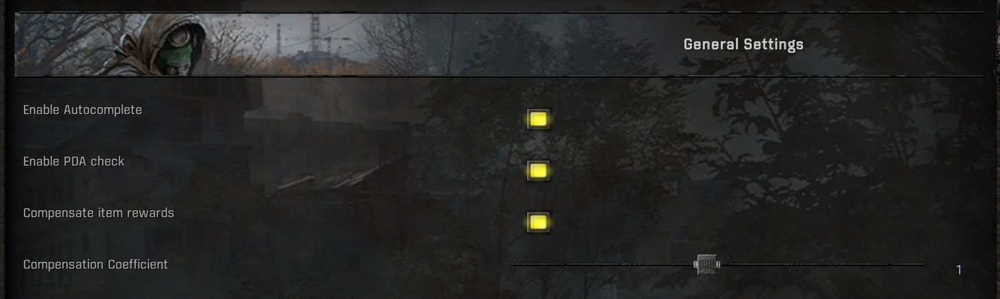
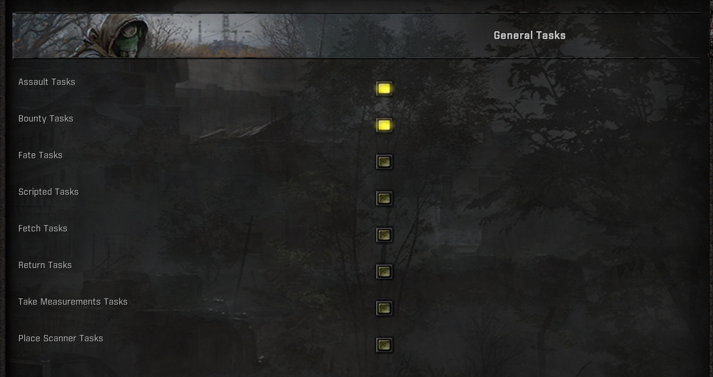
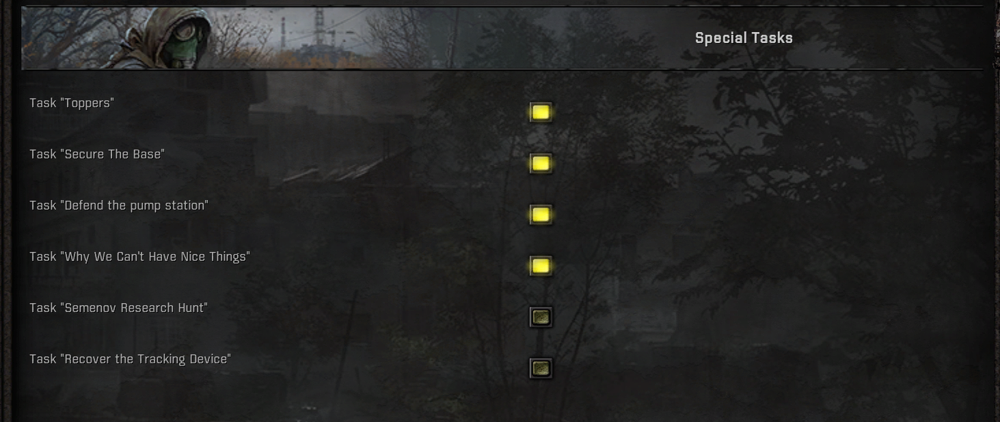

# Autocomplete Tasks

> Note: If you have any suggestions write me a [DM](https://www.moddb.com/messages/compose?to=Tosox) on ModDB or Discord [@tosox]

## Description

This addon completes tasks as soon as the conditions are met without having to return to the task giver. By default it completes all bounty, mutant killing, assault and a few other tasks.

## What is new?

Since [AeneasH's](https://www.moddb.com/members/aeneash) [Autocomplete Unofficial](https://www.moddb.com/mods/stalker-anomaly/addons/autocomplete-unofficial-1-5-1) following things have changed:
* Compatibility with custom tasks (e.g. [Weird Task Framework](https://www.moddb.com/mods/stalker-anomaly/addons/weird-tasks-framework) tasks)
* Improved performance
* MCM support

## Installation

* Install the mod (preferably with [Mod Organizer](https://github.com/ModOrganizer2/modorganizer/releases/))
* Open the game and enjoy

## I want to whitelist/blacklist task X
1. Get the ID of the task. It should look something like this: bar_visitors_barman_stalker_trader_task_2. You can find all vanilla tasks defined in this directory after unpacking the game files: gamedata/configs/misc/task/tm_\*.ltx
2. If you only know the name of the task you can check gamedata/configs/text/[eng/rus]/st_quests_\*.xml and search for the name of the task
3. Next, copy the text above the title in the quotation marks without "_name" from the end. Now you have the task ID
4. Paste the task ID in the whitelist/blacklist input field in the MCM settings (Autocomplete Tasks -> Other).  Make sure to separate multiple ids with a comma (",").
5. Apply the changes

## Preview

